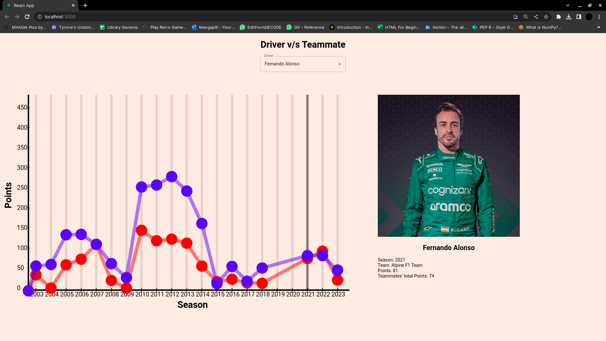
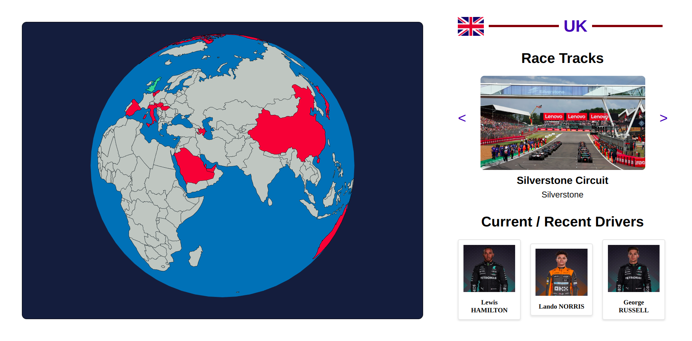
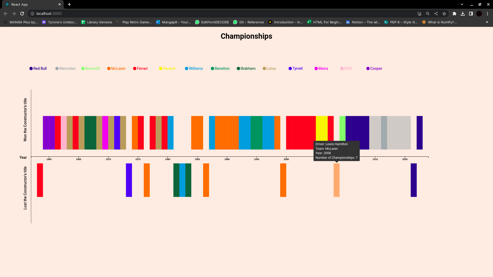
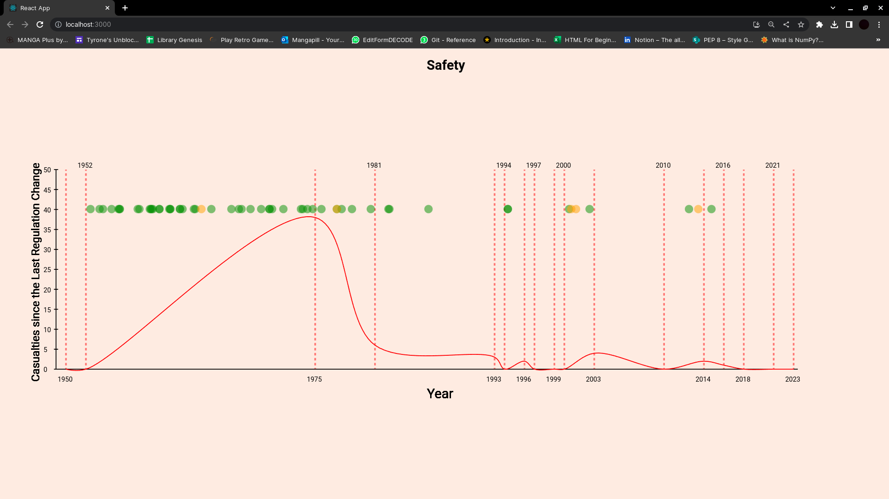
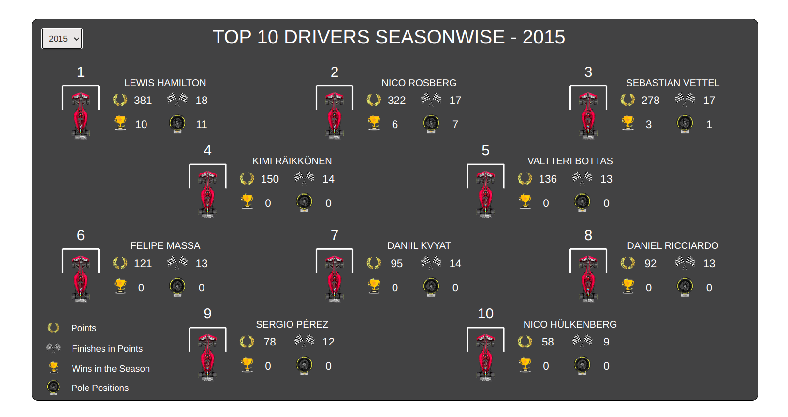
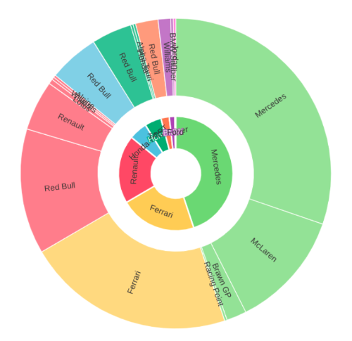

# Final Report

## Driver Head To Head
* <u>What:</u> We are visualizing a head to head of drivers against their teammates (in that particular season) over all the seasons the driver had participated.

* <u>Why:</u> Drivers cannot be solely compared to all other drivers based on number of wins or number of points in a season. This is because even though driver ability has a part to play in these aspects, the car has a very significant hand in influencing these features. They say that F1 is a team sport. While this may be true, your teammate is the one you absolutely must beat at all costs, as they have the same car as you. If you cannot beat the one with the same car as you, how can you believe that you can stand toe to toe against the best in the world, and deserve to be called the world champion (an unspoken rule in the F1 world - you need to be confident enough to think you are the best in the world).

* <u>How:</u> Hence, we have created a visualization (from the 2003 season onwards) to compare a driver to the sum total of their teammates in terms of points, using 2 distinct line graphs (Line graphs make it easier to visually compare 2 values along with progression over time). The blue line depicts the selected driver's points, and the red line their teammate's. Beside the graph, we placed a picture of the driver and the driver's name. Underneath the picture and name, we have a portion which shows a message. On hovering over one of the lines representing a particular season, we get a message if the driver didn't race in that season, and a points comparison if they did. This gives users a view of how the driver performs compared to other drivers in the same car, and hence provides a better (still not highly accurate) qualitative review of the driver's performance. Hovering over one of the lines (either yours or your teammate's) highlights it (attempting to superimpose it).

  

## Diversity of F1

* <u>Why:</u> For a long time, Formula 1 has been criticized for being a sport dominated by wealthy white Europeans. However, in recent years, there has been a concerted effort to diversify the sport and make it more inclusive for people from different regions and backgrounds.
One of the ways that F1 is doing this is by expanding the number of tracks around the world. F1 now has races in various countries across the globe, from small European nations to places like the United States, Mexico, Canada, and the Middle East. By hosting events in different regions, F1 is helping to promote the sport to new audiences and provide opportunities for aspiring drivers from diverse backgrounds.

* <u>How:</u> To provide a visual representation of F1's global expansion, we have created a new interactive visualization. The visualization features a globe that displays all current circuits for the 2023 season, as well as future and returning circuits for the 2024 season. Each country that hosts an F1 track is highlighted in red, and clicking on a country changes the color to green and displays pictures of all the race tracks, along with their names and locations on the right-hand side of the screen. In addition, the visualization showcases current drivers and recent drivers who have participated in F1 since 2010, with their photos displayed prominently. The globe is fully interactive, with zooming in and out and dragging functionality, and rotates at a constant speed, providing users with an engaging and informative experience. This visualization offers a unique and immersive way for fans to explore F1's global expansion and its diverse lineup of drivers.

 

  

## Top 10 of 3 Categories:
* We are trying to show information about the 10 greatest drivers in different aspects: Our chosen aspects are - most overall points, most championships, most wins.
* Top 10 drivers statistics based on championships, points, wins (done) + Top 10 constructors based on metrics such as wins, championships, etc (yet to do) + on clicking a circle it shows up a nested svg where we show a visualization about the points/position per race of that season.(yet to do)

  

## Championships Over the Years:
* <u>What:</u> We are visualizing the effect a constructor has on the driver's championship, if any, as well as how dominant a particular constructor or driver has been for a contiguous set of seasons.

* <u>Why:</u> We want to see if there is a correlation between the constructor's champions and the driver's champion, to see how much the car affects the driver's championship over driver ability. We also want to see periods of dominance and patterns of dominance of particular constructors, particular drivers, and both together over a period of time in the overall timeline of the sport (so essentially 1958-2022, as the constructor's championship started in 1958), as it could have an insight on how interesting the season is for a newcomer who's looking to learn more about the sport. (Boring seasons usually fall in the middle of dominant periods, and generally not much insight into new rules can be gained as not much action leading to rule-breaking happens).

* <u>How:</u> We have made a sort of timeline graph, with blocks representing the constructor of the driver that won the driver's championship in that season, and being above/below representing whether the constructor won the constructor's championship or not respectively. On hovering over one of the blocks, we highlight all the drivers championships won by the driver who won the championship during the year represented by that particular block, making it easier to see periods of driver dominance. Since we color coded based on constructor colors, it is already evident which constructor has what periods of dominance (if any), although hovering over the constructor name still highlights championships won by a driver of the particular constructor. We also have a tooltip on the particular blocks and the constructors' names in the legend depicting more information on the championships.

 

## Safety Over The Years
* <u>What:</u> We are visulizing how safety in the sport has evolved over the years.

* <u>Why: </u> F1 is an entertaining sport, but it is also very dangerous. There have been many casualties on the track, both drivers and volunteers, and there have been many regulations added to make the sport safer for both drivers and by-standers. We wanted  to show a correlation (if any) between the added regulations and the casualties in the sport, and how safe the sport is in this day and age.

* <u>How: </u> We use a curved line chart to depict how many casucalties occur between any 2 consecutive regulation changes (and the latest season, in the case of the last regulation change). We have highlighted the years of major regulation changes, clicking on which gives us more information about what the regulation that changed was and how many casualties occured since the previous regulation change. We have also depicted the driver casualties (green dots) and marshall casualties(yellow dots), hovering over which gives us more information about the incident.

* 
  

## Top 10 Drivers Seasonwise

* <u>What:</u> We are visualizing the top 10 drivers for each season 2003 onwards through a grid-system.

* <u>Why:</u> The graphical representation of the top 10 drivers in each F1 season from 2003 onwards serves as a significant and informative tool in understanding the sport's evolution. From the early dominance of Michael Schumacher to the rise of Sebastian Vettel and Lewis Hamilton's ongoing pursuit of records and accolades, this graph offers a fascinating window into the history of F1 racing. By analyzing their performance over time, we can find valuable insights into the dynamics and trends of F1 racing. We can identify the drivers who enjoyed prolonged spells of success, and those who had fleeting moments of glory. Through this graph, we can explore the rich history and continual evolution of F1 in a visually engaging manner.

* <u>How:</u> For this visualization, we have designed a grid system that showcases the top 10 drivers of each F1 season from 2003. The grid presents an array of statistical information about each driver, including their points in the season, number of top 10 finishes, total number of wins, and positions earned in each race. This view of each driver's performance over time allows viewers to assess the relative dominance of a particular driver, as well as the competitiveness of individual seasons. Additionally, on hovering over a driver's name, the grid provides information about that driver's performance in a particular season. 

 

  

## Correlation between Engine and Constructor Performance

* <u>What:</u> We have made a sunburst chart representing engines and the particular constructors they supply.

* <u>Why:</u> By visualizing the performance of engine manufacturers and the teams that use them, we can gain valuable insights into the dynamics of F1 racing. We can see which engine manufacturers have been the most successful over time, and how their performance has varied depending on the teams they supply. We can also explore how individual teams have performed over the years and how changes in engine manufactures have impacted their success. 

* <u>How:</u> For this visualization, we have used a sunburst chart. The chart's first layer provides a quick overview of the engine manufacturers used by the constructors, and clicking on an engine manufacturer reveals the constructors that have used that particular engine. The size of each segment indicates the number of wins for each engine and constructor, allowing for an easy comparison of their respective performances.
Hovering over a particular engine or constructor also displays the number of wins they have had. 

 

## A growing bar chart:

This chart is an animated growing/racing bar chart for a particular season which shows the progression of points of each driver after each round. The drivers are in descending order of final points on the x axis. The y axis represents points so far. 
Colour of the bar represents the team of the driver, so it is easy to relate with his teammate.
After every 800ms, the round changes to next, and points are updated.
User can select the season from the dropdown box given.
The same visualisation is done for constructors points.
A basic demo is given below: (Look at growingbar.html for the animation

## Contributions:
* Shashwat Dash: Globe visualization, Grid Visualization, Sunburst
* Rohan Girish: Head 2 Head, Championships Over the Years, Safety Visualization
* Sarthak Chittawar: Top 10s, Drivers vs Points Per Round Growing Bar, Helped in Others.

# Code Link
https://github.com/Rohan-G/Data-Visualization-Project

# Video
https://drive.google.com/drive/folders/1nCsKZX7gCxuvHcXrdeOT3MI7vasSKQY-?usp=share_link